# 1st Assignmet for cloud engineering students in Altschool Africa V3 students

Your login name: altschool i.e., home directory /home/altschool. The home directory contains the following sub-directories: code, tests, personal, misc Unless otherwise specified, you are running commands from the home directory.

**Questions**

1. Change directory to the tests directory using absolute pathname

1. Change directory to the tests directory using relative pathname

1. Use echo command to create a file named fileA with text content ‘Hello A’ in the misc directory

1. Create an empty file named fileB in the misc directory. Populate the file with a dummy content afterwards

1. Copy contents of fileA into fileC

1. Move contents of fileB into fileD

1. Create a tar archive called misc.tar for the contents of misc directory

1. Compress the tar archive to create a misc.tar.gz file

1. Create a user and force the user to change his/her password upon login

1. Lock a users password

1. Create a user with no login shell

1. Disable password based authentication for ssh

1. Disable root login for ssh


**Answers:**

**Your login name: altschool i.e., home directory /home/altschool.**
**The home directory contains the following sub-directories: code, tests, personal, misc**
**Unless otherwise specified, you are running commands from the home directory.**

```
sudo useradd -m -s /usr/bin/bash Altschool

```

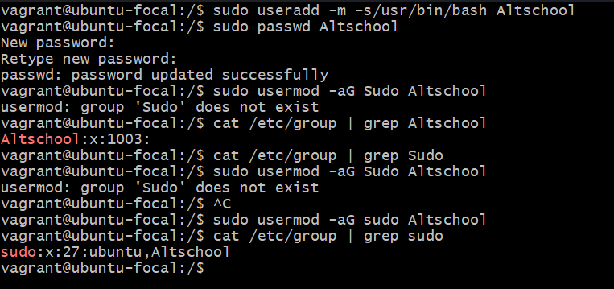

**Here**, the 

``` useradd ``` command enters us to create a new user (user login simply means user)


switch ```m```  creates a user with home directory.

switch ```-s /usr/bin/bash```  specifies the default login shell for the user.

I went futher to create a password for the user using ```sudo passwd Altschool```. ```passwd``` helps to create password for the user.

**To switch user since we are running commands with our Altschool login user**

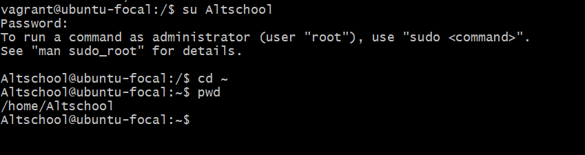

```su Altschool```
```su``` - This commands helps us to switch to a new user ```sudo``` meaning **super user do** allows us to perform administrative task that on a normal you can't perform unless you are a root user.

```pwd``` - used to check my current working directory or folder(for window users).

**To create subdirectories in the Altschool home directory**

```mkdir code tests personal misc```

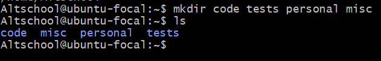

```ls``` - stands for list (as in list your commands).
```mkdir``` - creates a new directory or folder. keynote, when you create a directory it changes colour, in my case, it changed to colour blue (I think that's the same colour for everyother system).

1. Change directory to the tests directory using absolute pathname

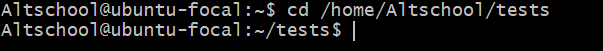

```cd /home/Altschool/tests```

```cd``` - stands for change directory, it helps to navigate to other directory. 
**Absolute path** - It calls the complete path to a directory , it starts from the root (```/```) and calls everyother path that follows it.

2. Change directory to the tests directory using relative pathname

``cd tests/``

Here, I used ``cd ..`` to move a step backward

``pwd`` to check my working directory

``ls`` to list all the files saved in Altschool home directory and then used ``cd`` to navigate to my directory called **tests** since my current directory is already ``/home/Altschool/``.

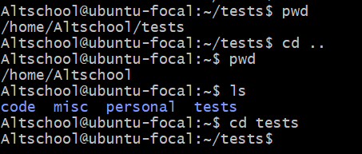

3. Use echo command to create a file named fileA with text content ‘Hello A’ in the misc directory

``echo "Hello A" > /home/Altschool/misc/fileA``

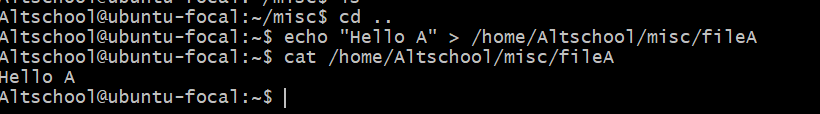

``echo`` command is one of the commands used for creating files.

``>`` is used for creating a file while ``>>`` is used for adding more text to the already created file.

``/home/Altschool/misc/fileA`` is an example of an absolute path.

4. Create an empty file named fileB in the misc directory. Populate the file with a dummy content afterwards

``touch fileB``

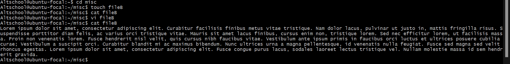

``cat fileB`` **cat** stands for concatenate,it is use for viewing files.

``vi fileB`` is a text editor, it was what I used to populate a dummy text.

5. Copy contents of fileA into fileC

``cp fileA fileC``

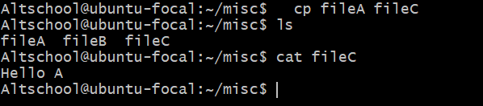

``cp`` is a command for copying a file and since I was already in my misc directory, I simply copied file from A to C and the interesting thing about linux is that it just created my fileC not withstanding that I didn't have it before.

6. Move contents of fileB into fileD

```mv fileB fileD```

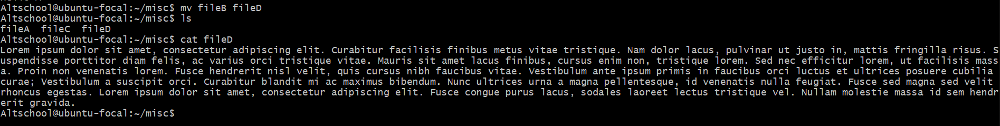

```mv``` It behaves like copy command but here, you are literally cutting and pasting elsewhere. it is used to rename a particular file without adding a duplicate.

7. Create a tar archive called misc.tar for the contents of misc directory

```tar -cvf misc.tar *```
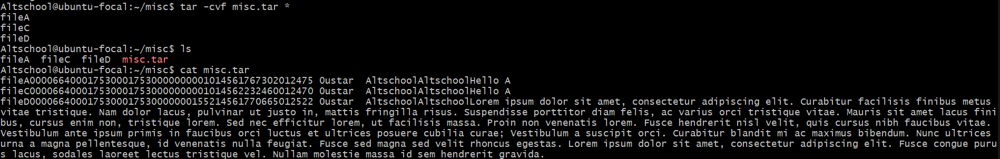

**Here**
```tar``` command is used to archive files and directories in Linux systems.

```-cvf```  c here  is used to create archive, v  stands for **verbose**. which helps to display detailed information about the files and directories being archived while the f stands for **file**. It is used to specify the name of the archive file.

``*`` means everything, so it archieves everything in the directory.

8. Compress the tar archive to create a misc.tar.gz file

``` gzip misc.tar```

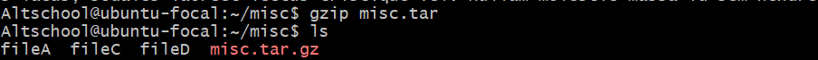

```gzip``` is a command used to compress files.


9. Create a user and force the user to change his/her password upon login

```sudo chage -d 0 beingoma```

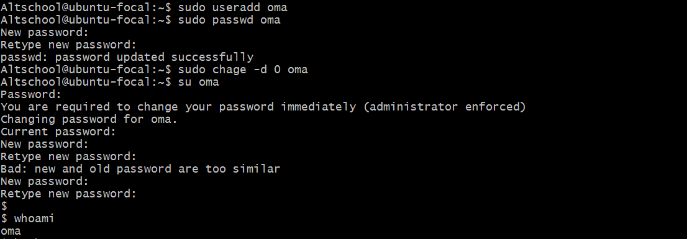

```chage``` it allows one to change the number of days between password changes.


10. Lock a users password

``` sudo passwd -l oma```

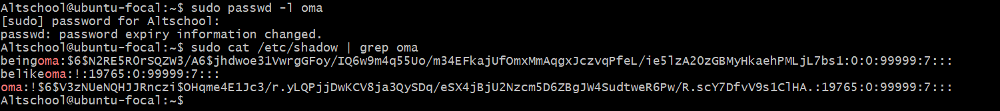

```-l``` is use to lock a users password

11. Create a user with no login shell

```sudo useradd -s /usr/sbin/nologin premiumpie```


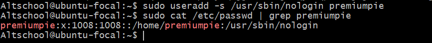

12. Disable password based authentication for ssh

```sudo vi /etc/ssh/sshd_config```

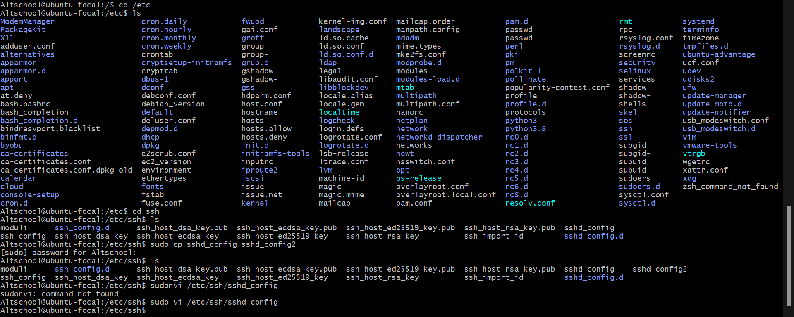

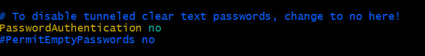
13. Disable root login for ssh


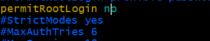

To achieve numbers 12 and 13, I first called up ```/etc/ssh``` for Altschool user and duplicated ```sshd_config```, this is best so shold incase i mistakenly malhandle my original file, i will have another one to hold onto.